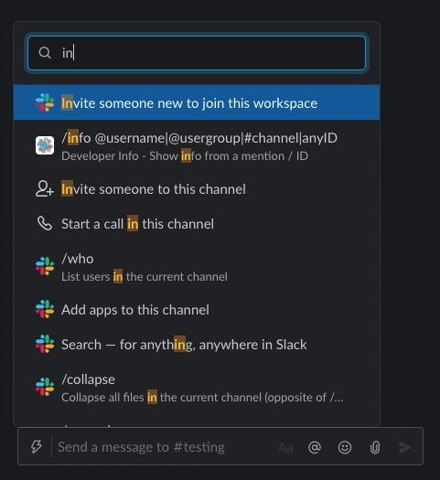

    
    <h1>Slack Developer Info</h1>
    

        <b>Developer oriented bot that prints information about a @user, @usergroup or #channel</b>
    

    

        
        
        
        
    

    
   
        <!-- Add to slack -->
        
    

     
     
     

## Commands

- **/info** _@user_ - View info about a user
- **/info** _@usergroup_ - View info about a usergroup
- **/info** _#channel_ - View info about a channel

## Demo

## Supporters

## Related

- [Lightning Delete](https://github.com/khrj/lightning-delete)
- [Bolt Cross Workspace Starter](https://github.com/khrj/bolt-cross-workspace-starter)